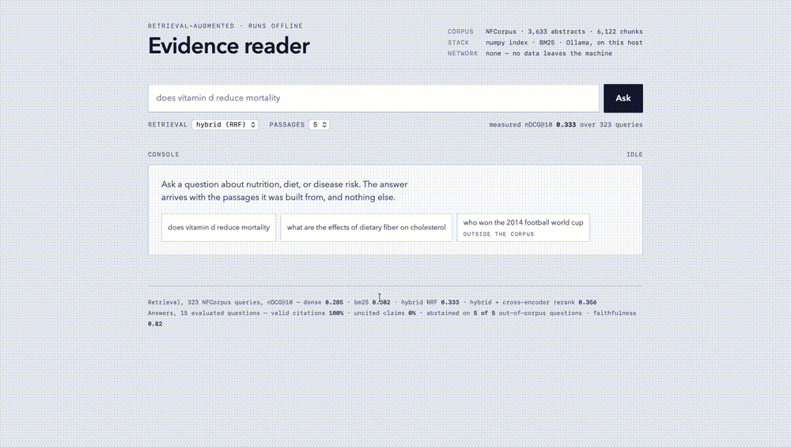
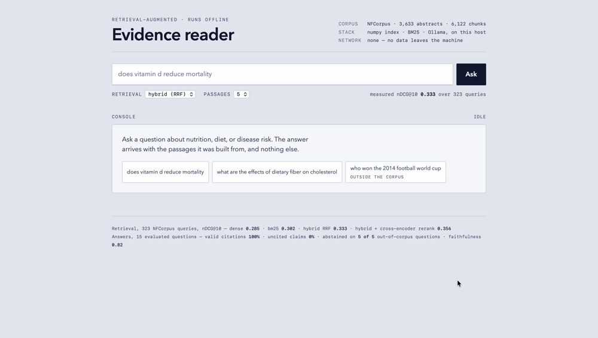
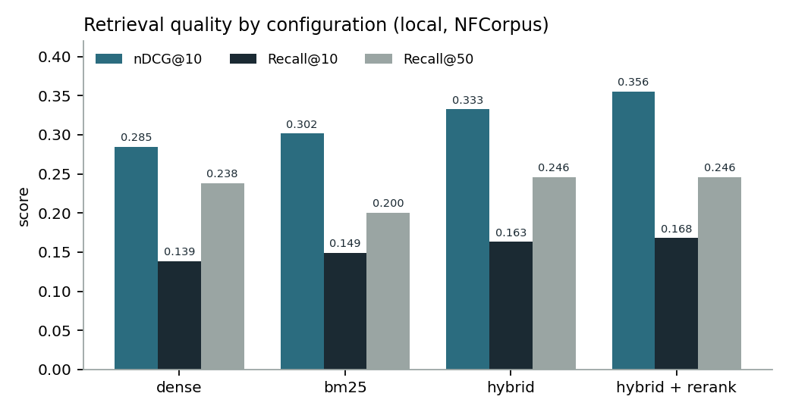
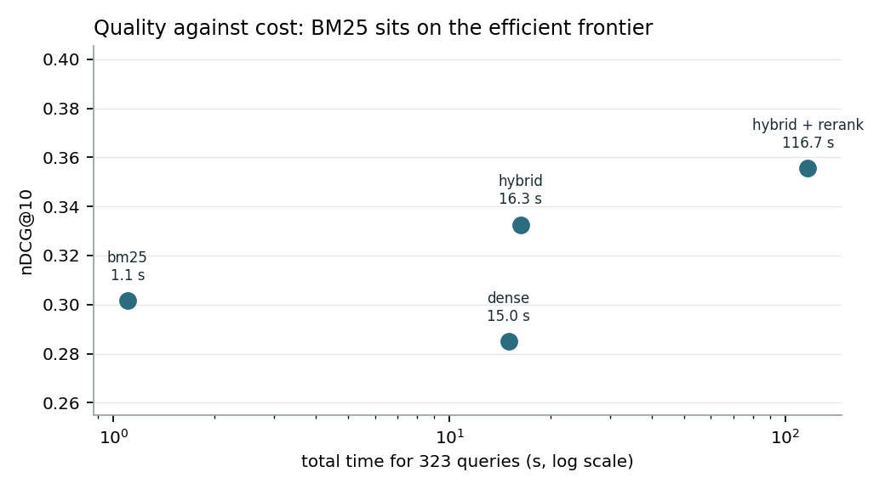
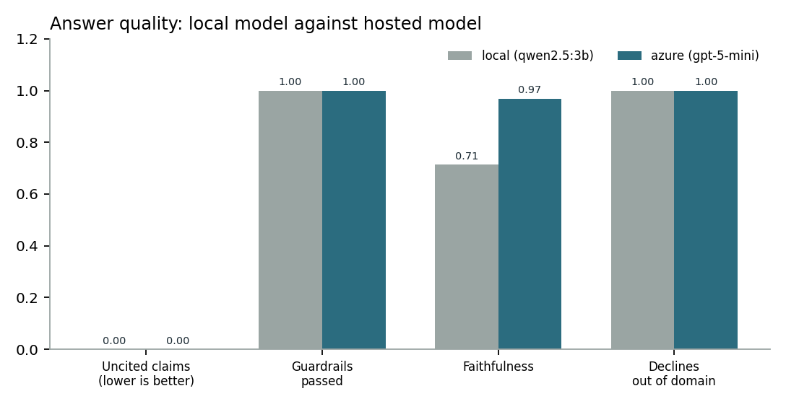
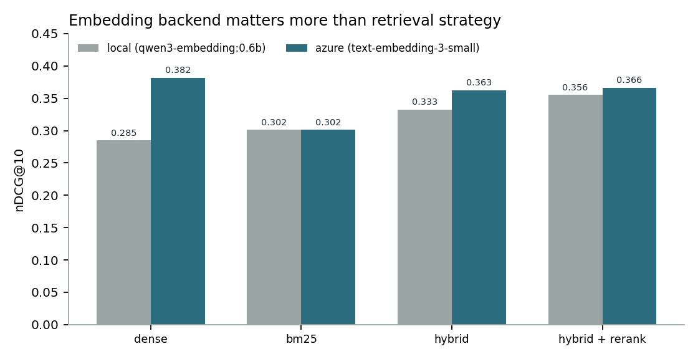
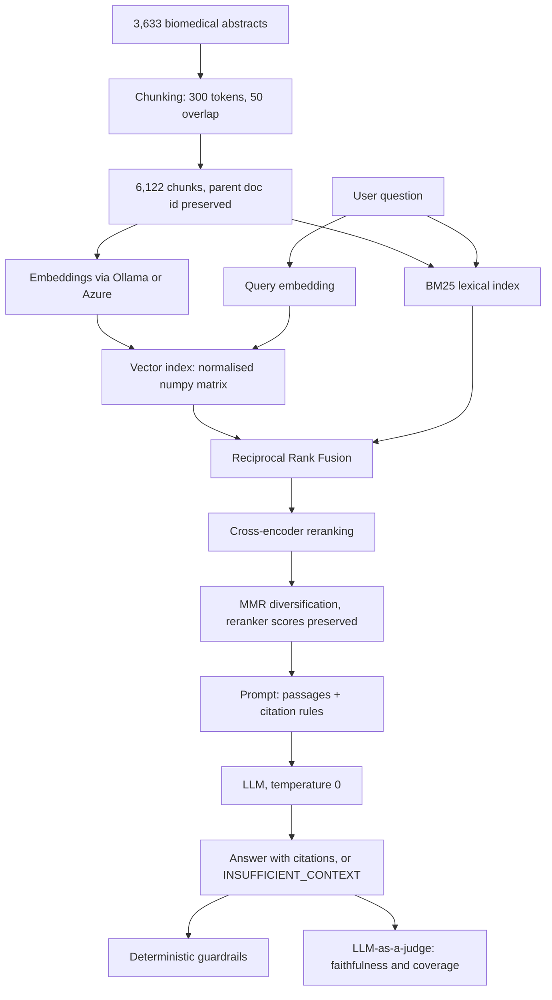
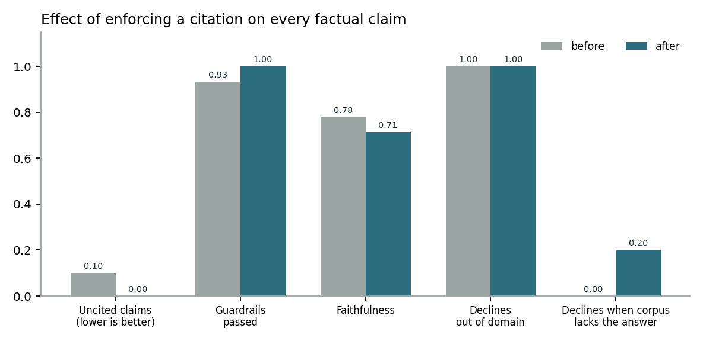

# RAG Benchmark: Local vs Cloud

**A retrieval-augmented question answering system on a medical corpus, benchmarked end to end on two infrastructures: fully local (Ollama) and hosted (Azure OpenAI). It cites its evidence, declines when the corpus cannot answer, and proves both with numbers.**


---

## 🎬 Demo



Ask a question, get an answer where every factual sentence carries a citation, and click any `[n]` to reveal the exact passage that supports it. Verification is one click away, so the reader never has to take the model's word for it.

### And when the corpus cannot answer



Retrieval always returns something, even for a question about football, because nearest-neighbour search has no notion of "nothing here is relevant". The system detects it and declines instead of guessing. **This is the behaviour that makes a RAG usable on data where a wrong answer is a liability.**

---

## 🧰 Stack

| Layer | Technology |
|---|---|
| **Language** | Python 3.12 |
| **Local inference** | Ollama (`qwen3-embedding:0.6b`, `llama3.1:8b`) |
| **Cloud inference** | Azure OpenAI (`text-embedding-3-small`, `gpt-5-mini`) |
| **Vector search** | NumPy (normalised matrix, cosine as dot product) |
| **Lexical search** | `rank-bm25` (BM25 Okapi) |
| **Reranking** | `sentence-transformers` cross-encoder (`ms-marco-MiniLM-L-6-v2`) |
| **API** | FastAPI + Uvicorn, Pydantic schemas, OpenAPI docs |
| **Interface** | Single self-contained HTML page, no build step, no CDN |
| **Packaging** | Docker + Docker Compose |
| **CI** | GitHub Actions: 22 unit tests, lint, image build |
| **Benchmark** | NFCorpus (BEIR), 323 queries with human relevance judgments |
| **Metrics** | nDCG@10, Recall@k, faithfulness, coverage against a golden set, deterministic guardrails |
| **Figures** | Matplotlib, regenerated from measured results |

---

## ⚡ TL;DR

- **Lexical search beat semantic search** on this medical corpus: BM25 scored 0.302 nDCG@10 against 0.285 for dense retrieval, running 14 times faster.
- **A well-chosen local model matches the hosted one.** llama3.1:8b reached 0.98 faithfulness against 0.97 for gpt-5-mini, at zero marginal cost and with no data leaving the machine.
- **Grounding comes from the system, completeness comes from the model.** Zero uncited claims across every model tested; coverage of expected answer points ranged from 0.19 to 0.49 on the same prompt and the same passages.
- **Two plausible improvements failed and are reported as such.** A retrieval confidence threshold cut unsupported claims to 3.3% but refused 43.3% of answerable questions.
- **Three bugs in the measurement harness produced plausible wrong numbers.** All three are now regression tests running in CI.

---

## 🎯 The problem

Most organisations that would benefit from an internal AI assistant cannot use one, for two reasons that have nothing to do with model quality:

1. **Their documents cannot leave their infrastructure.** Medical, legal, industrial and HR corpora are exactly the ones where a RAG pipeline pays off, and exactly the ones that cannot be sent to a third-party API.
2. **A fluent wrong answer is worse than no answer.** A system that invents a plausible claim about a drug interaction or a contract clause is not a productivity tool, it is a liability.

This project addresses both, and measures whether it actually succeeds.

The corpus is medical on purpose: 3,633 PubMed abstracts on nutrition and health, the exact domain where an organisation is least free to send its data elsewhere. The abstracts themselves are public, which is what makes the benchmark reproducible; the pipeline and its constraints are built for the case where they would not be.

## ✨ What makes it different

Most RAG repositories demonstrate that a pipeline runs. This one measures **how much each decision is worth, and what it costs**:

- 🔬 Four retrieval strategies on a public benchmark with human relevance judgments, latency reported alongside every score.
- 🧪 Three separate axes of answer quality: is it grounded, is it complete, does it survive a badly phrased question.
- ☁️ The same pipeline against Azure OpenAI on identical queries, so the local-versus-cloud trade-off is quantified rather than asserted.
- 📉 Negative results kept in: two attempted improvements made things worse and are reported with the numbers that killed them.

---

## 📊 Key results

### Retrieval quality, and what it costs

Measured on 323 NFCorpus test queries with human relevance judgments. All runs measured back to back with models already loaded, so latencies are comparable.

| Strategy | nDCG@10 | Recall@10 | Recall@50 | Time (323 queries) |
|---|---|---|---|---|
| Dense only | 0.285 | 0.139 | 0.238 | 15.0 s |
| BM25 only | 0.302 | 0.149 | 0.200 | **1.1 s** |
| Hybrid (RRF) | 0.333 | 0.163 | 0.246 | 16.3 s |
| Hybrid + cross-encoder rerank | **0.356** | **0.168** | 0.246 | 116.7 s |



**Lexical search beat semantic search on this corpus.** BM25 scored higher than dense retrieval while running 14 times faster. Medical vocabulary (drug names, conditions, dosages) carries a great deal of signal that a small embedding model dilutes into a general topic.

**The full pipeline costs 100 times more than BM25 for 18% more quality.** If a client needs a working prototype tomorrow, BM25 alone delivers 85% of the final quality at 1% of the compute.

**Reranking improves ranking but not coverage.** Recall@50 is identical with and without it (0.246), because reranking only reorders candidates the first stage already found. The ceiling is set by first-stage retrieval.



### Answer quality: grounded, and complete

Two different questions, measured separately, because a system can be perfect on one and fail the other. Grounding asks whether what was said is supported. Coverage asks whether what should have been said was said at all.

| Metric | llama3.1:8b (local) | gpt-5-mini (Azure) | qwen2.5:3b (local) |
|---|---|---|---|
| Uncited claims (lower is better) | **0.00** | **0.00** | **0.00** |
| Citations valid and complete | **100%** | **100%** | **100%** |
| Faithfulness (LLM judge) | **0.98** | 0.97 | 0.71 |
| Coverage of expected points | 0.43 | **0.49** | 0.19 |
| Declines out-of-domain questions | **100%** | **100%** | **100%** |
| Declines the unanswerable question | **yes** | **yes** | no |
| Median end-to-end latency | 14.0 s | **6.1 s** | 9.9 s |



**Grounding is a property of the system. Completeness is a property of the model.**

Every model tested, from a 3B local one to a hosted frontier one, produced zero uncited claims, valid citations and perfect out-of-domain abstention. That guarantee comes from the prompt and the guardrails, and it survives a change of provider.

Coverage does not. The same prompt and the same passages produced 0.19 with one local model and 0.43 with another. **No prompt change closed that gap**: rewriting the instructions to demand exhaustiveness moved coverage by one point out of 37.

**And the gap is not about size.** Qwen 7B scored exactly the same coverage as Qwen 3B, while Llama 8B more than doubled it at comparable size. Instruction-following training, not parameter count, is what separates them. A model that reports one of five findings is safe and useless; picking the right local model recovers 88% of hosted coverage.

---

## 🎯 Completeness: what a golden dataset revealed

Faithfulness cannot see omission. A perfectly grounded answer can report one of the five things its sources say, and every metric above will call it correct.

To measure that, expected answer points were written **by reading the retrieved passages**, not from medical knowledge: 37 points across 9 questions, each one stated by a passage the system actually receives. The distinction matters. A golden set written from domain knowledge measures whether the model knows medicine; written from the corpus, it measures what this project claims.

Two refinements the exercise produced:

**Expected absences.** For some questions the corpus supports the context but not the conclusion. A correct answer states the absence rather than inventing the link. Every model scored 1.00 on this: they are prudent, and prudence was never the problem.

**One question was mislabelled.** "Does fasting improve insulin sensitivity" has no answer in this corpus. The word appears only in *fasting glucose* and *fasting insulin*, which name a measurement taken in the fasted state, not a practice. BM25 matched the surface form and the harness scored the correct refusal as a failure. **Building the golden set is what exposed it.**

---

## 🧪 Robustness: what happens when the question is asked badly

Real users do not type benchmark queries. Each of the 10 answerable questions was rewritten three ways, with the clean version as its own control: vague, colloquial with typos, and buried in irrelevant context.

| Configuration | Answers with uncited claims | Refuses a question it could answer | Stable | Retrieval overlap |
|---|---|---|---|---|
| Baseline | 20.0% | 6.7% | 73.3% | 0.27 |
| + confidence threshold (dense) | 20.0% | 6.7% | 73.3% | 0.27 |
| + confidence threshold (BM25 ≥ 12) | 16.7% | 20.0% | 63.3% | 0.27 |
| + confidence threshold (BM25 ≥ 16) | 3.3% | 43.3% | 53.3% | 0.27 |
| **+ reranking (MMR bug fixed)** | **10.0%** | **6.7%** | **83.3%** | **0.38** |

**The failure mode was the opposite of the expected one.** The system rarely refuses a question it could answer (6.7%). It does something worse: 20% of rewritten questions received an answer containing unsupported claims. Retrieval overlap with the clean question was only 27%, so **retrieval breaks before generation does**, and the model answers from tangential passages that are too weak to support anything and too plausible to trigger abstention.

**Counter-intuitive:** the verbose style, where the real question is buried in noise, scored 10/10 from the start. The irrelevant context supplies vocabulary BM25 can match. The danger is the short question, not the rambling one.

### The confidence threshold: a rejected idea, with the numbers that rejected it

Retrieval scores were calibrated on three populations to see whether a threshold could separate "answerable" from "badly phrased":

| Signal | In-domain, clean | In-domain, vague | Out-of-domain |
|---|---|---|---|
| Dense cosine (top-1) | 0.589 to 0.774 | 0.492 to 0.623 | 0.263 to 0.358 |
| BM25 (top-1) | 16.4 to 27.4 | 8.3 to 17.3 | 12.6 to 15.8 |
| RRF fusion score | almost always 0.0164 or 0.0328 | same | same |

Three findings, all useful:

**The fusion score carries no confidence information.** RRF values were essentially only 1/(60+1) and 2/(60+1). RRF measures *agreement between rankers*, not relevance. That is exactly what makes it scale-independent, and exactly what makes it useless as a confidence signal.

**The dense signal separates out-of-domain cleanly, and vague phrasing not at all.** Vague questions keep their topic, so they stay above any threshold that excludes off-topic ones. The threshold protects against the wrong failure.

**The BM25 threshold buys safety at a prohibitive price.** It cut unsupported claims to 3.3% and pushed false refusals to 43.3%: nearly half of all users turned away. Rejected on the measurement, not on intuition.

### What did work, and the bug it uncovered

Enabling the cross-encoder on the generation path halved unsupported claims at no cost in refusals, and lifted retrieval overlap from 0.27 to 0.38.

It only worked after fixing a silent bug: **MMR was recomputing relevance from dense cosine similarity and discarding the cross-encoder ordering entirely.** The reranker ran, cost its full latency, and changed nothing. The tell was retrieval overlap identical to four decimal places across runs that should have differed. Two components were deciding the final selection and the last one won, silently. It is now a regression test.

---

## ⚖️ Local vs Azure OpenAI

The same pipeline, the same queries, two infrastructures. Selection is a single environment variable.

| | 💻 Local (Ollama, M2 16 GB) | ☁️ Azure OpenAI (East US) |
|---|---|---|
| Embedding model | qwen3-embedding:0.6b (1024 d) | text-embedding-3-small (1536 d) |
| Generation model | llama3.1:8b | gpt-5-mini |
| Indexing 6,122 chunks | 2,058 s (3 chunks/s) | **201 s (31 chunks/s)** |
| Best retrieval nDCG@10 | 0.356 (hybrid + rerank) | **0.382 (dense alone)** |
| Retrieval latency, 323 queries | **15.0 s** | 81.6 s |
| Faithfulness | **0.98** | 0.97 |
| Coverage | 0.43 | **0.49** |
| Median answer latency | 14.0 s | **6.1 s** |
| Marginal cost per query | **0 (hardware amortised)** | per-token billing |
| Data leaves the host | **No** | Yes |



**The embedding model matters more than the retrieval strategy.** Switching to a stronger embedder gained +34% nDCG. Everything stacked on top of the weak embedder (fusion, reranking) gained +25%. And with the strong embedder the best configuration is the simplest one: plain dense retrieval beats hybrid and beats hybrid with reranking. **Hybrid search is compensation for a weak embedder, not a universal improvement.**

**Cloud wins on throughput, local wins on interactive latency.** Azure indexed 10 times faster (large batches amortise the network round trip) but answered single retrieval queries 5 times slower (a three-word query is almost pure network latency to another continent). For an interactive assistant, data sovereignty costs nothing in response time. It costs once, at indexing.

**On answer quality the gap is narrow.** A well-chosen local model matches the hosted one on faithfulness (0.98 versus 0.97) and reaches 88% of its coverage, at zero marginal cost and with no data leaving the machine. The remaining cost is generation latency: 14 s versus 6 s.

---

## 🏗️ Architecture



### No vector database, on purpose

6,122 vectors of 1024 dimensions is a 25 MB matrix that fits in memory, where an exhaustive dot product runs in milliseconds. Qdrant, Pinecone or FAISS would add operational cost with no measured benefit. The rule applied throughout: **a dependency is added when a measurement proves it necessary**, not before. This decision would be revisited at TREC-COVID scale (171k documents).

### Every chunk keeps its parent document id

Relevance judgments are made at document level; retrieval returns chunks. Without the parent id on every chunk, evaluation is impossible. Decided at ingestion time because it cannot be recovered later.

---

## 🔍 Retrieval, decision by decision

**Dense retrieval.** Vectors are L2-normalised at load time, which turns cosine similarity into a plain dot product: the entire search is one matrix multiplication. `argpartition` selects the top k without sorting the full corpus.

**BM25.** Scores on term overlap weighted by inverse document frequency. It excels exactly where dense retrieval is weakest: rare technical vocabulary. Kept as a first-class strategy, not a baseline, because it won on this corpus.

**Reciprocal Rank Fusion.** Cosine and BM25 scores live on incompatible scales, and normalising them is fragile. RRF uses rank only: a document at rank *r* contributes `1/(60 + r)`. Evidence that the two retrievers are genuinely complementary: hybrid Recall@50 (0.246) exceeds both components (0.238 and 0.200), so fusion surfaces documents neither ranked well alone.

**Cross-encoder reranking.** The index uses a bi-encoder, which embeds query and passage separately and therefore never sees their interaction. That is what makes the index precomputable, and what limits its precision. A cross-encoder scores the pair jointly: far more accurate, one forward pass per candidate. Hence two stages, cheap retrieval to 50 candidates, expensive reranking to reorder them.

**MMR diversification.** Applied at generation time only, never during retrieval evaluation. On the benchmark, diversity lowers nDCG, since nDCG measures only relevance. In the LLM context window the objective is different: five passages from one document give the model one source, five from five documents give it five. Measured effect: distinct documents in context went from 2 of 5 to 4 of 5, and generation latency dropped from 31.8 s to 14.0 s. **Two different objectives, optimised separately.** When a reranker runs first, MMR uses its scores rather than cosine similarity, which is the bug described above.

---

## 🛡️ Grounding and guardrails

### What the prompt enforces

1. Answer only from the numbered passages, never from the model's own knowledge.
2. Cite the passage number after every factual sentence.
3. Never draw a conclusion the passages do not state explicitly.
4. Report every finding that bears on the question, and say so when passages disagree.
5. Reply `INSUFFICIENT_CONTEXT` when no passage answers, without commenting on the passages.

Rule 3 was added after a real failure: an answer inferred that fasting improves insulin sensitivity from a passage stating only that intramyocellular lipid content indicates insulin sensitivity. Rule 4 was added to attack low coverage, and is reported above as having barely worked: **prompt rules fix reasoning failures, not capability limits.**

### Citation as a hallucination detector

That first failure produced the project's most useful finding. The uncited sentence was not a formatting slip, it was the visible symptom of an unsupported inference: **a model that invents cannot cite.** The citation rule is not a presentation constraint, it is a detection mechanism, and a mechanical one that needs no second model to run.



### Three layers of checking

**Deterministic guardrails** verify that every factual sentence carries a citation and that every citation points at a passage that exists. Free, reproducible, runnable on every answer in production, which an LLM judge cannot be.

**LLM-as-a-judge, faithfulness.** Scores sentence by sentence, shown **only the passages that sentence cites**, so it cannot rescue a claim using evidence the answer never pointed to.

**LLM-as-a-judge, coverage.** Asks, for each expected point independently, whether the answer states it. One narrow question per call is where a small judge stays reliable.

### Testing that the system knows when to stay silent

Five questions the corpus cannot answer (passport renewal, the 2014 World Cup, Kubernetes ingress) are part of the evaluation set, plus one in-domain question that turned out to be unanswerable.

The paired metric matters as much: **abstention on questions it could answer**. Without it, a 100% out-of-domain abstention rate proves nothing, since a system that refuses everything would also score 100%.

---

## 🐛 Three bugs in the measurement harness, and how they were caught

Every number here depends on code that nothing verified for most of this project. Three defects shipped unnoticed, and none of them crashed: they silently produced plausible wrong numbers.

**A citation parser that only understood one style.** The hosted model was reported at 20% hallucination. Every claim was in fact cited, in `[1,5,3]` and `[1][3][4]` grouping styles the regex did not match. The local model never used those styles, so the defect stayed invisible until the two were compared. Fixing it also moved local faithfulness from 0.82 to 0.71 with no change to the system.

**MMR discarding the reranker.** Described above. Detected because retrieval overlap was identical to four decimal places across runs that should have differed.

**An output filename that ignored part of the configuration.** Reranked runs overwrote their own baseline, so an ablation table silently showed one configuration twice.

All three are now regression tests. **Twenty-two unit tests run in CI on every commit**, covering nDCG and recall against hand-computed values, every citation style, RRF's rank-only behaviour, and MMR's use of an externally supplied relevance signal.

What CI deliberately does *not* run: the evaluation itself. It needs Ollama, 25 GB of models and half an hour of compute. Pretending otherwise would produce a green badge that means nothing.

---

## ⚙️ Engineering

**FastAPI** exposes `POST /ask` with the retrieved passages, per-stage timings and citation flags in the response. An answer without its sources is not auditable.

**Cold start was the real latency bottleneck, not the model.** First request: 3,337 ms retrieval. Diagnosis: Ollama unloads models after a few idle minutes, so the first caller paid the reload. Fixed with `keep_alive=-1` plus a warm-up call at startup. Result: **128 ms, a 17-fold improvement with no change to the search algorithm.** The bottleneck was resource lifecycle, and only measurement made it visible.

**Docker.** The API is containerised; Ollama deliberately stays on the host, because containerised Ollama has no access to Apple Silicon GPU acceleration. Measured cost of the container network hop: 310 ms versus 128 ms, negligible against seconds of generation.

**Provider abstraction.** `get_embedder()` and `get_llm()` select an implementation from an environment variable. The rest of the pipeline never knows which provider answers. This made the local-versus-Azure comparison a configuration change rather than a rewrite, and it is what makes the two sets of numbers directly comparable. Swapping the local model for a different family was likewise one line.

---

## 📁 Project structure

```
src/
├── chunking.py           token-based chunking, parent doc id preserved
├── embeddings/           provider interface + Ollama and Azure implementations
├── retrieval/            vector index, BM25, RRF fusion, reranking, MMR, triage
├── generation/           prompts, LLM interface, end-to-end answering
├── eval/                 metrics, guardrails, judge, golden set, question sets
└── api/                  FastAPI service and demo interface
scripts/                  download, indexing, evaluation, calibration, figures
tests/                    22 unit tests, run in CI
results/                  every measurement in this README, as JSON
docs/                     figures, regenerated from results/
```

Every number in this README comes from a file in `results/`, and every figure is regenerated by `scripts/plot_results.py`. Nothing is written by hand.

---

## 🚀 Running it

```bash
cp .env.example .env
python -m venv .venv && source .venv/bin/activate
pip install -r requirements.txt

# Local models
ollama pull qwen3-embedding:0.6b
ollama pull llama3.1:8b

# Corpus and index
python -m scripts.download_data
python -m scripts.chunking
python -m scripts.embed_corpus

# API and demo interface at http://localhost:8000
uvicorn src.api.main:app
```

Or with Docker, with Ollama running on the host:

```bash
docker compose up --build
```

**Evaluation:**

```bash
python -m scripts.evaluate hybrid rerank        # retrieval metrics
python -m scripts.evaluate_answers local-v1     # grounding and abstention
python -m scripts.evaluate_golden local-v1      # completeness
python -m scripts.evaluate_robustness local-v1  # rephrasing robustness
python -m scripts.calibrate_threshold           # score distributions
python -m scripts.plot_results                  # regenerate figures
pytest                                          # 22 unit tests
```

**Switching to Azure OpenAI:** set `EMBEDDING_BACKEND=azure`, `LLM_BACKEND=azure` and the four `AZURE_*` variables in `.env`. Nothing else changes.

---

## ⚠️ Limitations

Stated rather than omitted, because a benchmark whose limits are hidden is not a benchmark.

**The judges are LLMs.** Both faithfulness and coverage are scored by a model. Their verdicts correlate with human judgment but do not replace it. A stronger judge can be set via `JUDGE_MODEL`.

**Small samples on the answer side.** 15 questions for grounding, 37 expected points for coverage, 30 variants for robustness. Each robustness case is worth 3.3 points, so differences of a few points are indicative, not significant. Retrieval metrics, on 323 queries with human judgments, are on much firmer ground.

**The golden set was written by one person from the retrieved passages.** It measures whether the system reports what its sources say, not whether those sources are right. Judging medical correctness would need a clinician, which is outside this project's scope.

**The corpus is public and made of short English abstracts,** which avoids the PDF parsing and OCR problems that dominate real deployments on private document sets.

**Determinism is asymmetric.** Local generation runs at temperature 0 and reproduces exactly. The GPT-5 series accepts only its default temperature, so the Azure side is not strictly reproducible.

**Citation checking verifies that a claim is attributed, not that the attribution is apt.** The deterministic layer catches missing citations; only the judge assesses whether the cited evidence supports the claim.

---

## 🗺️ What comes next

- **Query expansion.** Retrieval overlap under rephrasing is 0.38: the reranker recovers what the first stage found, and nothing else. Rewriting vague queries before retrieval is the only remaining lever, and published results suggest it helps rephrased queries while hurting clean ones, so it must be measured on both.
- **Model routing.** Grounding is provider-independent but coverage is not. Routing simple questions to a small local model and multi-source syntheses to a larger one is plausible, and needs a predictive signal that does not yet exist here.
- **A larger answer-evaluation set**, in the 30 to 50 question range.
- **TREC-COVID** (171k documents), where the no-vector-database decision should be revisited.
- **Per-query cost accounting** from real Azure billing data.

---

## 💡 Takeaways

1. **Grounding comes from the system, completeness comes from the model.** Zero uncited claims and perfect out-of-domain abstention held across every model tested, from 3B local to hosted frontier. Coverage ranged from 0.19 to 0.49 on the same prompt and the same passages, and no prompt change closed the gap.
2. **Model choice matters more than model size, and more than where it runs.** Two local models of near-identical size differed by a factor of two on coverage. A well-chosen local model reaches 88% of hosted coverage and slightly better faithfulness.
3. **The embedding model matters more than the retrieval strategy.** Hybrid search and reranking compensate for a weak embedder; with a strong one, the simplest configuration wins.
4. **Requiring a citation on every claim is a hallucination detector,** not a formatting preference. A model that infers cannot cite.
5. **Two plausible improvements failed, and the numbers say why.** A retrieval confidence threshold cut unsupported claims to 3.3% but refused 43.3% of answerable questions. Prompt rules demanding exhaustiveness moved coverage by one point out of 37.
6. **Measurement tools have bugs too.** Three defects in the harness produced plausible wrong numbers rather than crashes. All three are now regression tests running in CI.

---

## License

MIT.