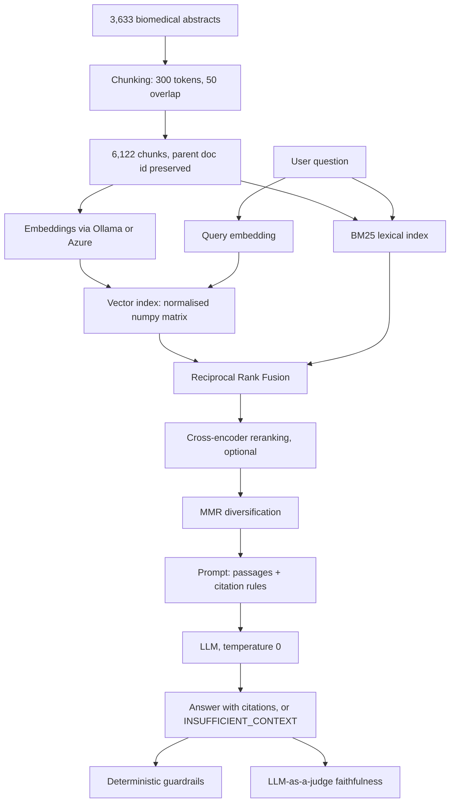

# RAG Benchmark: Local vs Cloud

**A retrieval-augmented question answering system on a medical corpus, benchmarked end to end on two infrastructures: fully local (Ollama) and hosted (Azure OpenAI). It cites its evidence, declines when the corpus cannot answer, and proves both with numbers.**


---

## 🎬 Demo


Ask a question, get an answer where every factual sentence carries a citation, and click any `[n]` to reveal the exact passage that supports it. Verification is one click away, so the reader never has to take the model's word for it.

### And when the corpus cannot answer


Retrieval always returns something, even for a question about football, because nearest-neighbour search has no notion of "nothing here is relevant". The system detects it and declines instead of guessing. **This is the behaviour that makes a RAG usable on data where a wrong answer is a liability.**

---

## 🧰 Stack

| Layer | Technology |
|---|---|
| **Language** | Python 3.12 |
| **Local inference** | Ollama (`qwen3-embedding:0.6b`, `qwen2.5:3b-instruct`) |
| **Cloud inference** | Azure OpenAI (`text-embedding-3-small`, `gpt-5-mini`) |
| **Vector search** | NumPy (normalised matrix, cosine as dot product) |
| **Lexical search** | `rank-bm25` (BM25 Okapi) |
| **Reranking** | `sentence-transformers` cross-encoder (`ms-marco-MiniLM-L-6-v2`) |
| **API** | FastAPI + Uvicorn, Pydantic schemas, OpenAPI docs |
| **Interface** | Single self-contained HTML page, no build step, no CDN |
| **Packaging** | Docker + Docker Compose |
| **Benchmark** | NFCorpus (BEIR), 323 queries with human relevance judgments |
| **Metrics** | nDCG@10, Recall@k, faithfulness (LLM-as-a-judge), deterministic guardrails |
| **Figures** | Matplotlib, regenerated from measured results |

---

## 🎯 The problem

Most organisations that would benefit from an internal AI assistant cannot use one, for two reasons that have nothing to do with model quality:

1. **Their documents cannot leave their infrastructure.** Medical, legal, industrial and HR corpora are exactly the ones where a RAG pipeline pays off, and exactly the ones that cannot be sent to a third-party API.
2. **A fluent wrong answer is worse than no answer.** A system that invents a plausible claim about a drug interaction or a contract clause is not a productivity tool, it is a liability.

This project addresses both, and measures whether it actually succeeds.

The corpus is medical on purpose: 3,633 PubMed abstracts on nutrition and health, the exact domain where an organisation is least free to send its data elsewhere. The abstracts themselves are public, which is what makes the benchmark reproducible; the pipeline and its constraints are built for the case where they would not be.

## ✨ What makes it different

Most RAG repositories demonstrate that a pipeline runs. This one measures **how much each decision is worth, and what it costs**:

- 🔬 Four retrieval strategies evaluated on a public benchmark with human relevance judgments, latency reported alongside every score.
- 🧪 Answer quality measured separately from retrieval quality, because a perfect retrieval can still produce a wrong answer.
- ☁️ The same pipeline run against Azure OpenAI on identical queries, so the local-versus-cloud trade-off is quantified rather than asserted.
- 📉 Negative and counter-intuitive results reported rather than hidden.

---

## 📊 Key results

### Retrieval quality, and what it costs

Measured on 323 NFCorpus test queries with human relevance judgments. All runs measured back to back with models already loaded, so latencies are comparable.

| Strategy | nDCG@10 | Recall@10 | Recall@50 | Time (323 queries) |
|---|---|---|---|---|
| Dense only | 0.285 | 0.139 | 0.238 | 15.0 s |
| BM25 only | 0.302 | 0.149 | 0.200 | **1.1 s** |
| Hybrid (RRF) | 0.333 | 0.163 | 0.246 | 16.3 s |
| Hybrid + cross-encoder rerank | **0.356** | **0.168** | 0.246 | 116.7 s |


**Three findings worth stating plainly:**

**Lexical search beat semantic search on this corpus.** BM25 scored higher than dense retrieval while running 14 times faster. Medical vocabulary (drug names, conditions, dosages) carries a great deal of signal that a small embedding model dilutes into a general topic.

**The full pipeline costs 100 times more than BM25 for 18% more quality.** If a client needs a working prototype tomorrow, BM25 alone delivers 85% of the final quality at 1% of the compute.

**Reranking improves ranking but not coverage.** Recall@50 is identical with and without it (0.246), because reranking only reorders candidates the first stage already found. The ceiling is set by first-stage retrieval.


### Answer quality and safety

Measured on 15 questions: 10 the corpus can answer, 5 it cannot.

| Metric | Local (qwen2.5:3b) | Azure (gpt-5-mini) |
|---|---|---|
| Uncited claims (lower is better) | **0.00** | **0.00** |
| Citations valid and complete | **100%** | **100%** |
| Faithfulness (LLM judge) | 0.71 | **0.97** |
| Declines out-of-domain questions | **100%** | **100%** |
| Declines when corpus lacks the answer | 0.20 | 0.20 |
| Median end-to-end latency | 9.9 s | **6.1 s** |


**The safety behaviour is a property of the system, not of the model.** Citation compliance and abstention are identical across a 3B local model and a hosted frontier model. Only faithfulness (whether cited claims are genuinely supported) differs. That means the guarantee comes from the prompt and the guardrails, and survives a change of provider.

**Both models decline the same two in-domain questions.** Manual inspection confirms the corpus genuinely contains no answer to them. A 20% in-domain abstention rate is therefore correct behaviour, not a failure.

---

## ⚖️ Local vs Azure OpenAI

The same pipeline, the same queries, two infrastructures. Selection is a single environment variable.

| | 💻 Local (Ollama, M2 16 GB) | ☁️ Azure OpenAI (East US) |
|---|---|---|
| Embedding model | qwen3-embedding:0.6b (1024 d) | text-embedding-3-small (1536 d) |
| Generation model | qwen2.5:3b-instruct | gpt-5-mini |
| Indexing 6,122 chunks | 2,058 s (3 chunks/s) | **201 s (31 chunks/s)** |
| Best retrieval nDCG@10 | 0.356 (hybrid + rerank) | **0.382 (dense alone)** |
| Retrieval latency, 323 queries | **15.0 s** | 81.6 s |
| Median answer latency | 9.9 s | **6.1 s** |
| Faithfulness | 0.71 | **0.97** |
| Marginal cost per query | **0 (hardware amortised)** | per-token billing |
| Data leaves the host | **No** | Yes |


**Two results here are worth more than the table itself.**

**The embedding model matters more than the retrieval strategy.** Switching to a stronger embedder gained +34% nDCG. Everything stacked on top of the weak embedder (fusion, reranking) gained +25%. And with the strong embedder, the best configuration is the simplest one: plain dense retrieval beats hybrid and beats hybrid with reranking. **Hybrid search is compensation for a weak embedder, not a universal improvement.**

**Cloud wins on throughput, local wins on interactive latency.** Azure indexed 10 times faster (large batches amortise the network round trip) but answered single queries 5 times slower (a three-word query is almost pure network latency to another continent). For an interactive assistant, data sovereignty therefore costs nothing in response time. It costs only at indexing time, once.

---

## 🏗️ Architecture



### No vector database, on purpose

6,122 vectors of 1024 dimensions is a 25 MB matrix that fits in memory, where an exhaustive dot product runs in milliseconds. Qdrant, Pinecone or FAISS would add operational cost with no measured benefit. The rule applied throughout this project: **a dependency is added when a measurement proves it necessary**, not before. This decision would be revisited at TREC-COVID scale (171k documents).

### Every chunk keeps its parent document id

Relevance judgments are made at document level; retrieval returns chunks. Without the parent id on every chunk, evaluation is impossible. This is decided at ingestion time because it cannot be recovered later.

---

## 🔍 Retrieval, decision by decision

**Dense retrieval.** Vectors are L2-normalised at load time, which turns cosine similarity into a plain dot product: the entire search is one matrix multiplication. `argpartition` selects the top k without sorting the full corpus.

**BM25.** Scores on term overlap weighted by inverse document frequency. It excels exactly where dense retrieval is weakest: rare technical vocabulary. Kept as a first-class strategy, not a baseline, because it won on this corpus.

**Reciprocal Rank Fusion.** Cosine and BM25 scores live on incompatible scales, and normalising them is fragile. RRF uses rank only: a document at rank *r* contributes `1/(60 + r)`. Evidence that the two retrievers are genuinely complementary: the hybrid Recall@50 (0.246) exceeds both of its components (0.238 and 0.200), so fusion surfaces documents neither retriever ranked well alone.

**Cross-encoder reranking.** The index uses a bi-encoder, which embeds query and passage separately and therefore never sees their interaction. That is what makes the index precomputable, and also what limits its precision. A cross-encoder scores the pair jointly: far more accurate, one forward pass per candidate. Hence a two-stage design, cheap retrieval to 50 candidates, expensive reranking to reorder them.

**MMR diversification.** Applied at generation time only, never during retrieval evaluation. On the benchmark, diversity lowers nDCG, since nDCG measures only relevance. In the LLM context window the objective is different: five passages from one document give the model one source, five passages from five documents give it five. Measured effect: distinct documents in context went from 2 of 5 to 4 of 5, and generation latency dropped from 31.8 s to 14.0 s. **These are two different objectives and they are optimised separately.**

---

## 🛡️ Grounding and guardrails

### The prompt enforces three rules

1. Answer only from the numbered passages provided, never from the model's own knowledge.
2. Cite the passage number after every factual sentence.
3. Reply `INSUFFICIENT_CONTEXT` when no passage answers the question, without commenting on the passages.

A fourth rule was added after a real failure: **never draw a conclusion the passages do not state explicitly.** One answer had inferred that fasting improves insulin sensitivity from a passage stating only that intramyocellular lipid content indicates insulin sensitivity. The passage supported no such claim.

### Citation as a hallucination detector

That failure produced the project's most useful finding. The uncited sentence was not a formatting slip, it was the visible symptom of an unsupported inference: **a model that invents cannot cite.** The citation rule is therefore not a presentation constraint, it is a detection mechanism, and a mechanical one that needs no second model to run.


### Two layers of checking

**Deterministic guardrails** verify that every factual sentence carries a citation and that every citation points at a passage that exists. Free, reproducible, and runnable on every answer in production, which an LLM judge cannot be.

**LLM-as-a-judge** scores faithfulness sentence by sentence, shown **only the passages that sentence cites**, so it cannot rescue a claim using evidence the answer never pointed to.

### Testing that the system knows when to stay silent

Five questions the corpus cannot answer (passport renewal, the 2014 World Cup, Kubernetes ingress) are part of the evaluation set. Detecting that nothing relevant was retrieved is a property of the prompt and guardrails, not of retrieval.

The paired metric matters as much: **abstention on in-domain questions**. Without it, a 100% out-of-domain abstention rate proves nothing, since a system that refuses everything would also score 100%.

---

## 🐛 The measurement harness has been wrong, and that is documented

While comparing providers, the hosted model was reported with a 20% hallucination rate. Inspection showed every claim was in fact cited, using `[1,5,3]` and `[1][3][4]` grouping styles the guardrail regex did not recognise. The local model never used those styles, so the defect had stayed invisible.

The parser was fixed and **every affected measurement was rerun on both providers**, which also moved the local faithfulness score from 0.82 to 0.71 without the system changing at all.

Two things follow, and both are in the numbers above rather than hidden: a measurement tool is a piece of software with its own bugs, and a comparison is only valid when both sides are measured by the same version of it.

---

## ⚙️ Engineering

**FastAPI** exposes `POST /ask` with the retrieved passages, per-stage timings and citation flags in the response. An answer without its sources is not auditable.

**Cold start was the real latency bottleneck, not the model.** First request: 3,337 ms retrieval. Diagnosis: Ollama unloads models after a few idle minutes, so the first caller paid the reload. Fixed with `keep_alive=-1` plus a warm-up call at startup. Result: **128 ms, a 17-fold improvement with no change to the search algorithm.** The bottleneck was resource lifecycle, and only measurement made it visible.

**Docker.** The API is containerised; Ollama deliberately stays on the host, because containerised Ollama has no access to Apple Silicon GPU acceleration. Measured cost of the container network hop: 310 ms versus 128 ms, negligible against 6,000 ms of generation.

**Provider abstraction.** `get_embedder()` and `get_llm()` select an implementation from an environment variable. The rest of the pipeline never knows which provider answers. This is what made the local-versus-Azure comparison a configuration change rather than a rewrite, and what makes the two sets of numbers directly comparable.

---

## 📁 Project structure

```
src/
├── chunking.py           token-based chunking, parent doc id preserved
├── embeddings/           provider interface + Ollama and Azure implementations
├── retrieval/            vector index, BM25, RRF fusion, reranking, MMR
├── generation/           prompts, LLM interface, end-to-end answering
├── eval/                 metrics, deterministic guardrails, LLM judge
└── api/                  FastAPI service and demo interface
scripts/                  data download, indexing, evaluation, figures
results/                  every measurement in this README, as JSON
docs/                     figures, regenerated from results/
```

Every number in this README comes from a file in `results/`, and every figure is regenerated by `scripts/plot_results.py`. Nothing is written by hand.

---

## 🚀 Running it

```bash
cp .env.example .env
python -m venv .venv && source .venv/bin/activate
pip install -r requirements.txt

# Local models
ollama pull qwen3-embedding:0.6b
ollama pull qwen2.5:3b-instruct

# Corpus and index
python -m scripts.download_data
python -m scripts.chunking
python -m scripts.embed_corpus

# API and demo interface at http://localhost:8000
uvicorn src.api.main:app
```

Or with Docker, with Ollama running on the host:

```bash
docker compose up --build
```

**Evaluation:**

```bash
python -m scripts.evaluate hybrid rerank      # retrieval metrics
python -m scripts.evaluate_answers local-v1   # answer metrics
python -m scripts.plot_results                # regenerate figures
```

**Switching to Azure OpenAI:** set `EMBEDDING_BACKEND=azure`, `LLM_BACKEND=azure` and the four `AZURE_*` variables in `.env`. Nothing else changes.

---

## ⚠️ Limitations

Stated rather than omitted, because a benchmark whose limits are hidden is not a benchmark.

**The faithfulness judge is an LLM,** and a 3B local one by default. Its verdicts correlate with human judgment but do not replace it. A stronger judge can be set via `JUDGE_MODEL`.

**Fifteen questions is an indication, not a measurement.** Answer-level metrics need 30 to 50 questions to be statistically defensible. Retrieval metrics, on 323 queries with human judgments, are on much firmer ground.

**The corpus is public and made of short English abstracts,** which avoids the PDF parsing and OCR problems that dominate real deployments on private document sets.

**Determinism is asymmetric.** Local generation runs at temperature 0 and reproduces exactly. The GPT-5 series accepts only its default temperature, so the Azure side is not strictly reproducible. This is a known asymmetry in the comparison.

**Citation checking verifies that a claim is attributed, not that the attribution is apt.** The deterministic layer catches missing citations; only the judge assesses whether the cited evidence actually supports the claim.

---

## 🗺️ What comes next

- Tests and CI running the metric and guardrail logic on every commit.
- A larger answer-evaluation set, in the 30 to 50 question range.
- TREC-COVID (171k documents), which is where the no-vector-database decision should be revisited.
- Per-query cost accounting from real Azure billing data.

---

## 💡 Takeaways

1. **The embedding model matters more than the retrieval strategy.** Hybrid search and reranking compensate for a weak embedder; with a strong one, the simplest configuration wins.
2. **Requiring a citation on every claim is a hallucination detector,** not a formatting preference. A model that infers cannot cite.
3. **Safety behaviour comes from the system, not the model.** Citation compliance and abstention were identical across a 3B local model and a hosted frontier model.
4. **Sovereignty costs throughput at indexing time, not latency at query time.** Cloud indexed 10 times faster and answered 5 times slower.
5. **Measurement tools have bugs too.** A citation-parsing defect produced a false 20% hallucination rate, and only cross-provider comparison exposed it.

---

## License

MIT.
